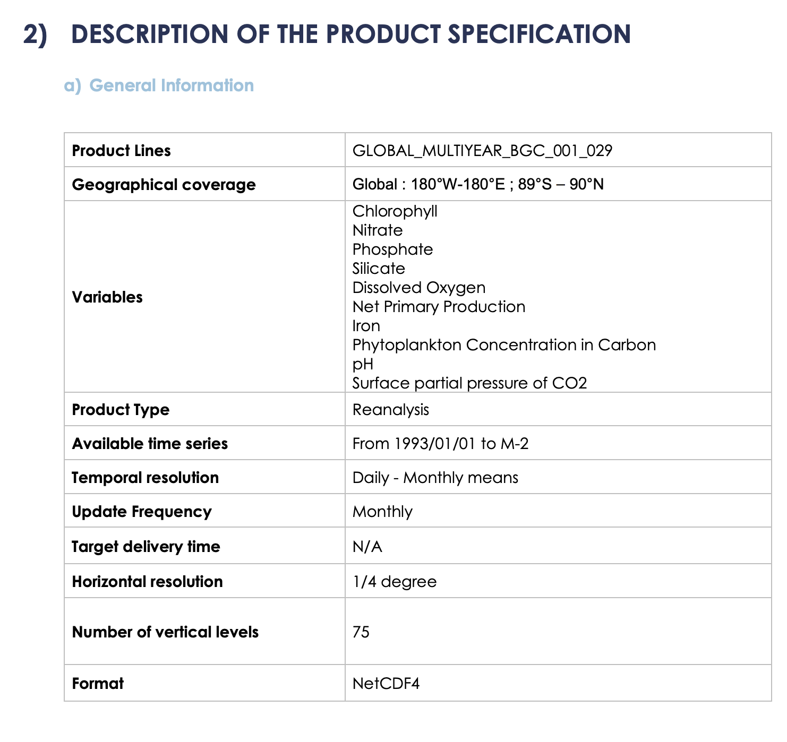

# 洋盆多维可视化平台

- 全球溶解氧0-6000米多维数据展示，实现三维透视
- 海洋多深度层数据分析
- 海洋剖面分析

## 初步分析

### 全球模型

[参考](https://myoceanglobe.marine.copernicus.eu/)

Q1: 三维透视是指什么? 

目前的设想是用户可以通过滑块选定溶解氧的值, 然后对等值面用 [marching cubes 算法](https://graphics.stanford.edu/~mdfisher/MarchingCubes.html) 构建并渲染

### 多深度层数数据分析, 剖面分析

Q2: 关于剖面分析, 怎样合理的从三维模型中提取出目标剖面 (用户该怎么操作才能得到他想要的目标的剖面图)

目前的设想是参考地形剖面, 采用相同的交互逻辑与采样方法, 希望支持多数据的显示

Q3: 需要对多深度层数, 剖面做哪些后端分析?

目前想做海洋溶解氧, 叶绿素相关的数据, 具体可以参考下面的 _数据源_, 请问老师针对这些数据具体有哪些后端分析可以做呢?

### 数据源

- [国家海洋环境预报中心](https://www.nmefc.cn/ybfw/styb/WestNorthPacific)
- [Copernicus Marine Data Store](https://data.marine.copernicus.eu/products?pk_vid=af6103db3d4548e717790159795188c5)

目前想做海洋溶解氧, 叶绿素相关的数据

- [Global Ocean Biogeochemistry Hindcast](https://data.marine.copernicus.eu/product/GLOBAL_MULTIYEAR_BGC_001_029/services)
  - [User Manual](https://documentation.marine.copernicus.eu/PUM/CMEMS-GLO-PUM-001-029.pdf)

## 项目框架

### 前端

- [React](https://zh-hans.react.dev/learn)
- [Cesium](https://cesium.com/learn/cesiumjs/ref-doc/Viewer.html#.ConstructorOptions)

### 后端

- [flask](https://fastapi.tiangolo.com/tutorial/first-steps/#define-a-path-operation-decorator)